# Results - 09/05/2020

## Overview

This document contains results from applying the __minimum-cost path__ method to determine the myocardial mass at-risk (MAAR) distal to coronary artery lesions using cardiac CT angiography.  This document used patient image datasets from the CONFRIM study.  Patients in the CONFIRM study were suspected of having CAD, and underwent cardiac CT angiography imaging.  Each patient was followed for ~ 2 years for occurence of major adverse cardiac events.  The CONFIRM study was a multicenter, international study.  The imaging system used for data acquisition was site-specific and therefore variable.  Patietns often had multiple coroanry lesions found on cardiac CT angiography.

## Aims
### 1. Is extent of MAARMCP distal to a patient's __culprit lesion__ predictive of myocardial infarction (MI)
- Processing summary for Aim 1 __(Figure 1)__
- Box plot of MAARMCP for MI and non-MI groups __(Figure 2)__
- ROC-AUC analysis of MAARMCP in predicting MI __(Figure 3)__
	
### 2. Is extent of total MAARMCP predictive of MI
- Processing summary for Aim 2 __(Figure 4)__
- Box plot of total MAARMCP for MI and non-MI groups __(Figure 5)__
- ROC-AUC analysis of total MAARMCP in predicting MI __(Figure 6)__

### 3. Is extent of MAARMCP distal to a patient's __culprit lesion__, normalized to the __minimum lumen diameter__ (MLD) of the lesion, predictive of MI
- Processing summary for Aim 3 __(Figure 7)__
- Box plot of MAARMCP normalized to MLD for MI and non-MI groups __(Figure 8)__
- ROC-AUC analysis of MAARMCP normalized to MLD  in predicting MI __(Figure 9)__

### 4. Is extent of total MAARMCP normalized to the __minimum lumen diameter__ (MLD) of the lesion predictive of MI
- Processing summary for Aim 4 __(Figure 10)__
- Box plot of total MAARMCP for MI and non-MI groups __(Figure 11)__
- ROC-AUC analysis of total MAARMCP in predicting MI __(Figure 12)__

### Terms
- Aims assessed both absolute and relative MAARMCP
	- Absolute MAAR (MAARMCP (abs)) calculated in grams
	- Relative MAAR (MAARMCP (rel)) calculated as MAARMCP (abs) / left ventricle mass (g) * 100
- MI was defined as occurence of STEMI, NSTEMI, or unstable angina
- __Culprit lesion__ defined as the "worst lesion" based on either invasive coronary angiography (if available) or cardiac CT angiography
- __Total MAARMCP__ defined as the sum of MAARMCP in each patient

## Figures
### Aim 1
Is extent of MAARMCP distal to a patient's __culprit lesion__ predictive of myocardial infarction (MI)
#### Figure 1:
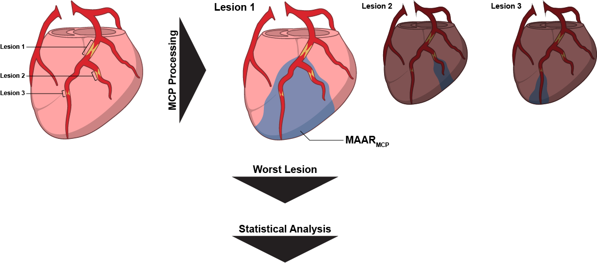
#### Figure 2
##### Figure 2A:
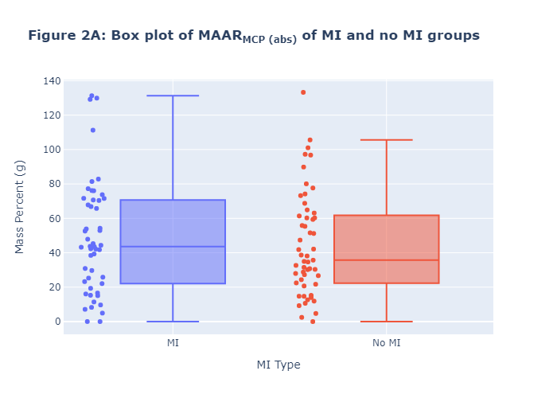

[Figure 2A: Interactive link](figs/html/figure2a.html)

[See Table 2A for descriptive analysis](#table-2a)

##### Figure 2B:

[Figure 2B: Interactive link](figs/html/figure2b.html)

[See Table 2A for descriptive analysis](#table-2a)

##### Figure 2C:
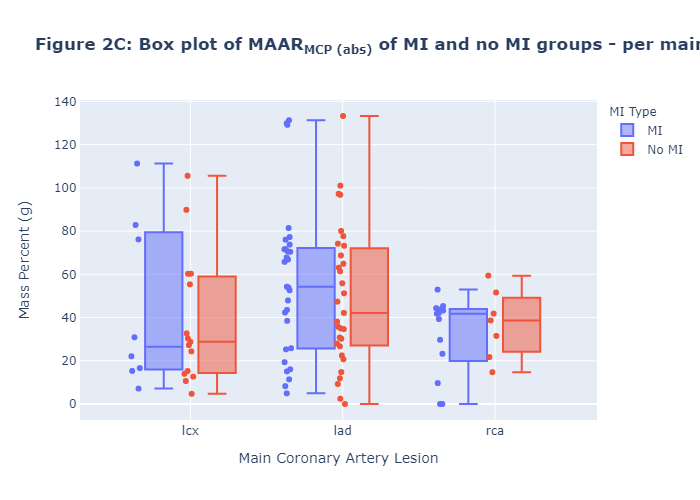

[Figure 2C: Interactive link](figs/html/figure2c.html)

[See Table 2B for descriptive analysis](#table-2b)

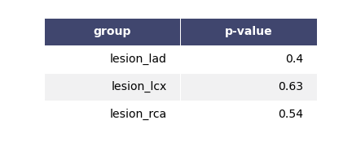

##### Figure 2D:
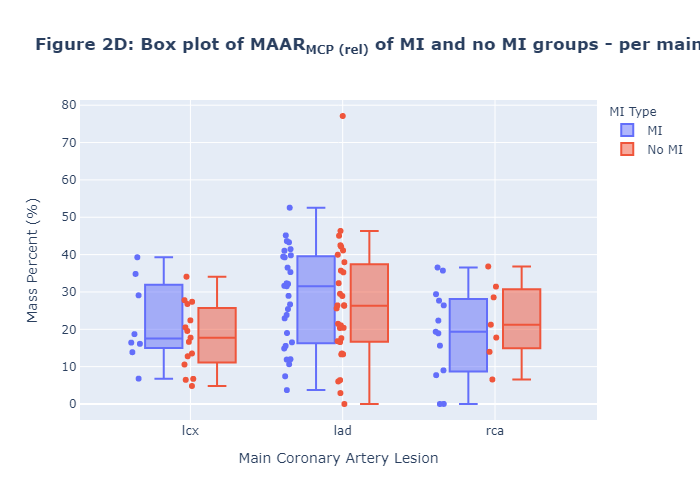

[Figure 2D: Interactive link](figs/html/figure2d.html)

[See Table 2B for descriptive analysis](#table-2b)

#### Table 2:
##### Table 2A:

##### Table 2B:
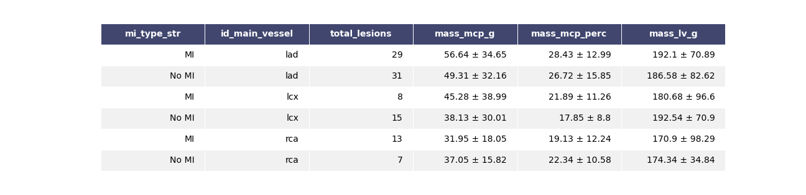

#### Figure 3
##### Figure 3A:
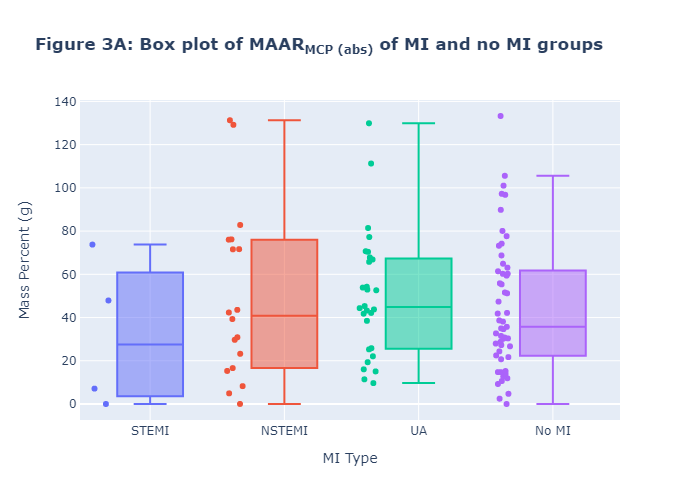

[Figure 3A: Interactive link](figs/html/figure3a.html)
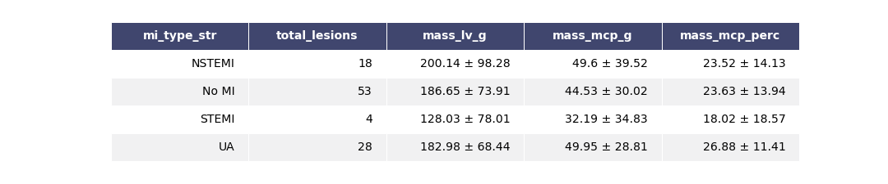

##### Figure 3B:
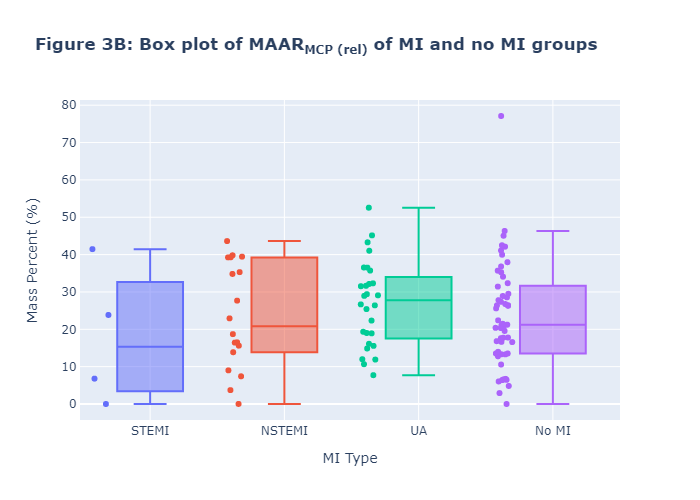

[Figure 3B: Interactive link](figs/html/figure3b.html)

##### Figure 3C:

[Figure 3C: Interactive link](figs/html/figure3c.html)
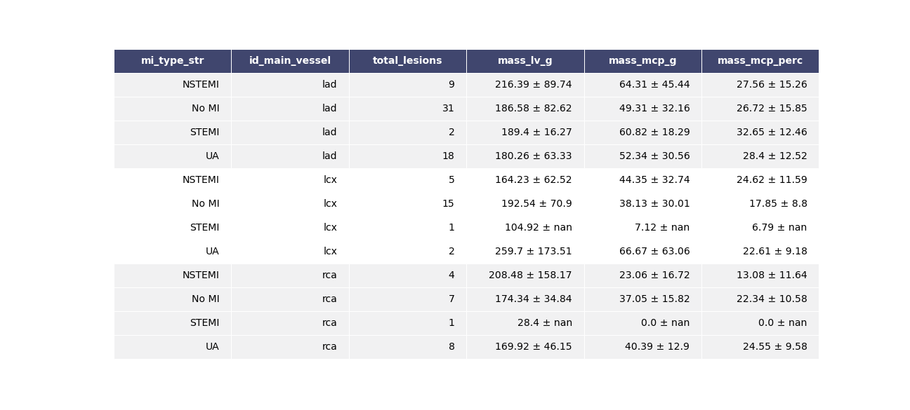

##### Figure 3D:
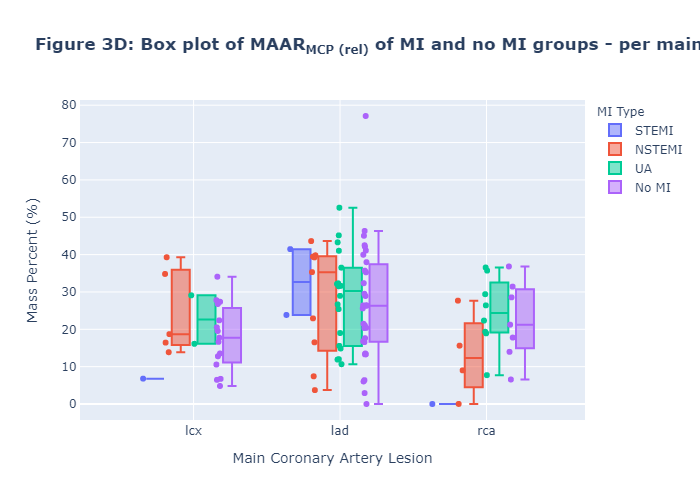

[Figure 3D: Interactive link](figs/html/figure3d.html)

### Aim 2
Is extent of total MAARMCP predictive of MI
#### Figure 4
#### Figure 5
#### Figure 6
### Aim 3
Is extent of MAARMCP distal to a patient's __culprit lesion__, normalized to the __minimum lumen diameter__ (MLD) of the lesion, predictive of MI
#### Figure 7
#### Figure 8
#### Figure 9
### Aim 4
Is extent of total MAARMCP normalized to the __minimum lumen diameter__ (MLD) of the lesion predictive of MI
#### Figure 10
#### Figure 11
#### Figure 12

