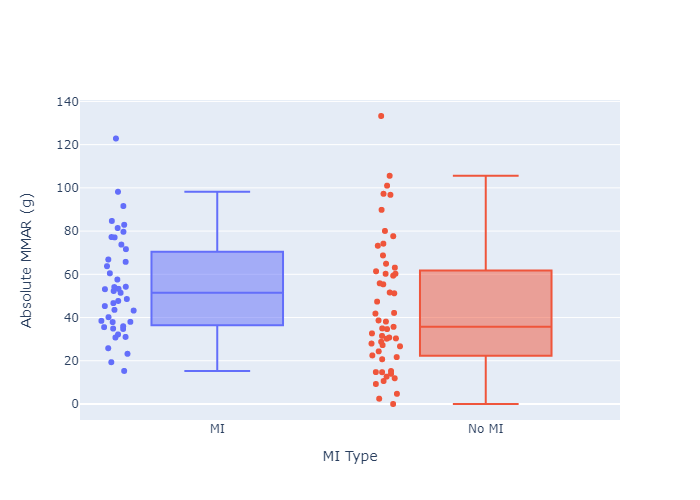
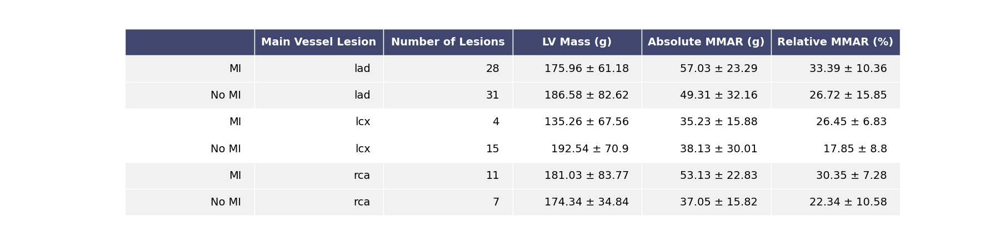
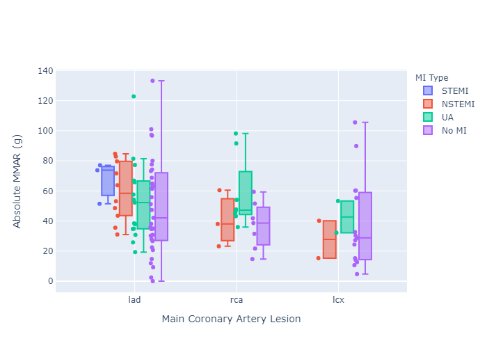
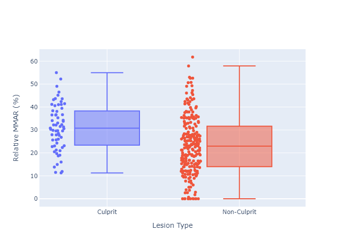
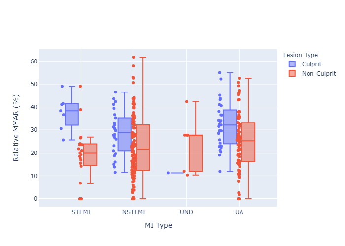
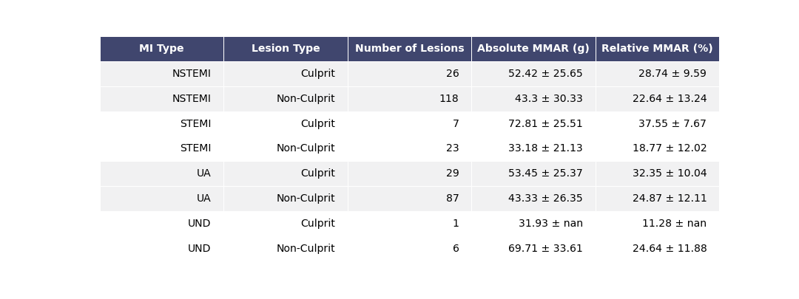

# Results - 09/05/2020

## Overview

This document contains results from applying the __minimum-cost path__ method to determine the myocardial mass at-risk (MMAR) distal to coronary artery lesions using cardiac CT angiography.  This document used patient image datasets from the CONFRIM study.  Patients in the CONFIRM study were suspected of having CAD, and underwent cardiac CT angiography imaging.  Each patient was followed for ~ 2 years for occurence of major adverse cardiac events.  The CONFIRM study was a multicenter, international study.  The imaging system used for data acquisition was site-specific and therefore variable.  Patietns often had multiple coroanry lesions found on cardiac CT angiography.

## Aims
### 1. Is extent of MMAR distal to a patient's __culprit lesion__ predictive of myocardial infarction (MI)
- Processing summary [__(Figure 1)__](#figure-1a)
- Box plot of MMAR for MI and non-MI groups [__(Figures 2A-2D)__](#figure-2A)
- Receiver operator characteristic curve of prognostic value of MMAR in predicting MI [__(Figure 2E)__](#figure-2e)
- Kaplan-Meier survival curve of MMAR versus MI [__(Figure 2F)__](#figure-2f)

### 2. Is there a significant difference between MMARMCP distal to culprit lesions verified using ICA and non-culprit lesions, in patients who had MI
- Box plot of MMAR for culprit versus non-culprit lesions in patients who had MI __(Figure 4)__

### 3. Is there a significant difference between MMARMCP distal to culprit lesions verified on ICA versus the "worst" lesion determined with CTA
- Box plot of MMAR for culprit lesions verified on ICA versus the "worst" lesion determined with CTA in patients who had MI __(Figure 5)__

### Terms
- Aims assessed both absolute and relative MMAR
	- MMAR was calculated using the minimum-cost path technique with previously acquired cardiac CT angiography (CTA) images
	- Absolute MMAR calculated in grams
	- Relative MMAR calculated as Absolute MMAR / left ventricle mass (g) * 100
- Myocardial infarction (MI) was defined as occurence of STEMI, NSTEMI, or unstable angina
- __Culprit lesion__ defined using either invasive coronary angiography (if available) or cardiac CT angiography
	- Invasive coronary angiography was used to verify the culprit lesion in _most_ patients who had a MI
		- Patients who had a MI, but did not have a culprit lesion defined, were __excluded__ from current analysis
	- CTA was used to determine the likely culprit lesion, using the minimum lumen diameter, in patients who did __not__ have a MI

## Figures
### Aim 1
Is extent of MMAR distal to a patient's __culprit lesion__ predictive of myocardial infarction (MI)

#### Figure 1:

__Figure 1: Patient selection criteria for Aim 1.__  Aim 1 sought to compare myocardial mass at-risk (MMAR) distal to CAD lesions in patients with and without a myocardial infarction (MI).  The minimum-cost path technique was used to determine MMAR for all lesions in each patient group.  Patients underwent cardiac CT angiography and were followed for two years for Major Adverse Cardiac Events.  (a) Patients with MI underwent invasive coronary angiography (ICA), during which a culprit lesion was verified (LesionICA).  LesionICA was then used to calculate MMAR for patients with MI.  (b) In patients without MI, the worst lesion was selected based on assessment using CTA (LesionCTA).  For the results in __Figure 2__, the lesion with the smallest __minimum lumen diameter__ was chosen as LesionCTA in patients without MI.

_MMAR:_  Myocardial mass at-risk calculated by applying the minimum-cost path technique to cardiac CT angiography images

_ICA:_  Invasive coronary angiography

_MI:_  Myocardial infarction, defined as ST-elevation MI, non-ST-elevation MI, or unstable angina

_CTA:_  Cardiac CT angiography

#### Figure 2
##### Figure 2A:

__Figure 2A:  Box plot of absolute MMAR of MI and no MI groups.__
Patients from the CONFIRM study were split into two groups, patients with and without myocardial infarction (MI).  Absolute myocardial mass at-risk (absolute MMAR) was assessed in this figure.  For patients with MI (blue), the culprit lesion verified with invasive coronary angiography* was used to calculate MMAR from the cardaic CT angiography (CTA) acquired prior to MI event.  For patients without MI (red), the lesion with the smallest minimal lumen diameter was selected to calculate MMAR.

_*Invasive coronary angiography was performed at time of MI_

_Absolute MMAR:_  Absolute myocardial mass at-risk calculated by applying the minimum-cost path technique to cardiac CT angiography images

_ICA:_  Invasive coronary angiography

_MI:_  Myocardial infarction, defined as ST-elevation MI, non-ST-elevation MI, or unstable angina

_CTA:_  Cardiac CT angiography

[Figure 2A: Interactive link](results-09052020-figs/html/figure2a.html)

[See Table 2A for descriptive analysis](#table-2a)

##### Figure 2B:

__Figure 2B:  Box plot of relative MMAR of MI and no MI groups.__
Patients from the CONFIRM study were split into two groups, patients with and without myocardial infarction (MI).  Relative myocardial mass at-risk (relative MMAR) was assessed in this figure, by normalizing absolute MMAR to respective patients' left ventricle mass.  For patients with MI (blue), the culprit lesion verified with invasive coronary angiography* was used to calculate MMAR from the cardaic CT angiography (CTA) acquired prior to MI event.  For patients without MI (red), the lesion with the smallest minimal lumen diameter was selected to calculate MMAR.  __Differences between relative MMAR between MI (blue) and no MI (red) groups was statistically significant (p-value <.05).__

_*Invasive coronary angiography was performed at time of MI_

_Relative MMAR:_  Relative myocardial mass at-risk calculated by applying the minimum-cost path technique to cardiac CT angiography images and normalizing to the respective patient's left ventricle myocardial mass

_ICA:_  Invasive coronary angiography

_MI:_  Myocardial infarction, defined as ST-elevation MI, non-ST-elevation MI, or unstable angina

_CTA:_  Cardiac CT angiography

[Figure 2B: Interactive link](results-09052020-figs/html/figure2b.html)
[See Table 2A for descriptive analysis](#table-2a)

##### Figure 2C:

__Figure 2C:  Box plot of abosulte MMAR of MI and no MI groups, stratified by main coronary lesion location.__
Patients from the CONFIRM study were split into two groups, patients with and without myocardial infarction (MI).  MI and no MI groups were stratified based on location of selected coronary lesion in either the left anterior descending (LAD), left circumflex (LCx) or right coronary artery (RCA).  Absolute MMAR was assessed in this figure.  For patients with MI (blue), the culprit lesion verified with invasive coronary angiography* was used to calculate MMAR from the cardaic CT angiography (CTA) acquired prior to MI event.  For patients without MI (red), the lesion with the smallest minimal lumen diameter was selected to calculate MMAR.

_*Invasive coronary angiography was performed at time of MI_

_Absolute MMAR:_  Absolute myocardial mass at-risk calculated by applying the minimum-cost path technique to cardiac CT angiography images

_ICA:_  Invasive coronary angiography

_MI:_  Myocardial infarction, defined as ST-elevation MI, non-ST-elevation MI, or unstable angina

_CTA:_  Cardiac CT angiography

[Figure 2C: Interactive link](results-09052020-figs/html/figure2c.html)

[See Table 2B for descriptive analysis](#table-2b)

##### Figure 2D:

__Figure 2D:  Box plot of relative MMAR of MI and no MI groups, stratified by main coronary lesion location.__
Patients from the CONFIRM study were split into two groups, patients with and without myocardial infarction (MI).  MI and no MI groups were stratified based on location of selected coronary lesion in either the left anterior descending (LAD), left circumflex (LCx) or right coronary artery (RCA).  Relative MMAR was assessed in this figure.  For patients with MI (blue), the culprit lesion verified with invasive coronary angiography* was used to calculate MMAR from the cardaic CT angiography (CTA) acquired prior to MI event.  For patients without MI (red), the lesion with the smallest minimal lumen diameter was selected to calculate MMAR.

_*Invasive coronary angiography was performed at time of MI_

_Relative MMAR:_  Relative myocardial mass at-risk calculated by applying the minimum-cost path technique to cardiac CT angiography images and normalizing to the respective patient's left ventricle myocardial mass

_ICA:_  Invasive coronary angiography

_MI:_  Myocardial infarction, defined as ST-elevation MI, non-ST-elevation MI, or unstable angina

_CTA:_  Cardiac CT angiography

[Figure 2D: Interactive link](results-09052020-figs/html/figure2d.html)

[See Table 2B for descriptive analysis](#table-2b)

##### Figure 2E:

__Figure 2E:  Receiver operator characteristic (ROC) curves of prognostic value of MMAR in predicting MI.__   Analysis was performed using absolute MMAR (red) and relative MMAR, normalized to left ventricle myocardial mass (blue).  Occurrence of myocardial infarction (MI) was the outcome assessed.  Area under the curve analysis was 0.63 (p-value <.05) and 0.71 (p-value <.05) for absolute and relative MMAR, respectively.

_Absolute MMAR:_  Absolute myocardial mass at-risk calculated by applying the minimum-cost path technique to cardiac CT angiography images

_Relative MMAR:_  Relative myocardial mass at-risk calculated by applying the minimum-cost path technique to cardiac CT angiography images and normalizing to the respective patient's left ventricle myocardial mass

_MI:_  Myocardial infarction, defined as ST-elevation MI, non-ST-elevation MI, or unstable angina

[See Table 2A for descriptive analysis](#table-2a)

##### Figure 2F:

__Figure 2F:  Kaplan-Meier survival curve analysis of relative MMAR and occurrence of MI.__ Using receiver operator characteristic (ROC) curve analysis from __Figure 2E__, a cutoff of 19.71% relative MMAR was used for survival curve analysis.  Occurrence of myocardial infarction (MI) was the outcome assessed.  

_Relative MMAR:_  Relative myocardial mass at-risk calculated by applying the minimum-cost path technique to cardiac CT angiography images and normalizing to the respective patient's left ventricle myocardial mass

_MI:_  Myocardial infarction, defined as ST-elevation MI, non-ST-elevation MI, or unstable angina

[See Table 2A for descriptive analysis](#table-2a)

#### Table 2:
##### Table 2A:

##### Table 2B:

### Aim 2
Is there a significant difference between MMARMCP distal to culprit lesions verified using ICA and non-culprit lesions, in patients who had MI

#### Figure 3
##### Figure 3A:

[Figure 3A: Interactive link](results-09052020-figs/html/figure3a.html)

[See Table 3A for descriptive analysis](#table-3a)

##### Figure 3B:

[Figure 3B: Interactive link](results-09052020-figs/html/figure3b.html)

[See Table 3A for descriptive analysis](#table-3a)

##### Figure 3C:

[Figure 3C: Interactive link](results-09052020-figs/html/figure3c.html)

[See Table 3B for descriptive analysis](#table-3b)

##### Figure 3D:

[Figure 3D: Interactive link](results-09052020-figs/html/figure3d.html)

[See Table 3B for descriptive analysis](#table-3b)

#### Table 3:
##### Table 3A:

##### Table 3B:

### Aim 3
Is there a significant difference between MMARMCP distal to culprit lesions verified on ICA versus the "worst" lesion determined with CTA

#### Figure 4
##### Figure 4A:

[Figure 4A: Interactive link](results-09052020-figs/html/figure4a.html)

[See Table 4A for descriptive analysis](#table-4a)

##### Figure 4B:

[Figure 4B: Interactive link](results-09052020-figs/html/figure4b.html)

[See Table 4A for descriptive analysis](#table-4a)

##### Figure 4C:

[Figure 4C: Interactive link](results-09052020-figs/html/figure4c.html)

[See Table 4B for descriptive analysis](#table-4b)

##### Figure 4D:

[Figure 4D: Interactive link](results-09052020-figs/html/figure4d.html)

[See Table 4B for descriptive analysis](#table-4b)

#### Table 4:
##### Table 4A:

##### Table 4B:

#### Figure 5
##### Figure 5A:

[Figure 5A: Interactive link](results-09052020-figs/html/figure5a.html)

[See Table 5A for descriptive analysis](#table-4a)

##### Figure 5B:

[Figure 5B: Interactive link](results-09052020-figs/html/figure5b.html)

[See Table 5A for descriptive analysis](#table-4a)

##### Figure 5C:

[Figure 5C: Interactive link](results-09052020-figs/html/figure5c.html)

[See Table 5B for descriptive analysis](#table-4b)

##### Figure 5D:

[Figure 5D: Interactive link](results-09052020-figs/html/figure5d.html)

[See Table 5B for descriptive analysis](#table-4b)

#### Table 5:
##### Table 5A:

##### Table 5B:

#### Figure 6
### Aim XX
#### Figure 7
#### Figure 8
#### Figure 9
### Aim XX
#### Figure 10
#### Figure 11
#### Figure 12

