# Results - 09/05/2020

## Overview

This document contains results from applying the __minimum-cost path__ method to determine the myocardial mass at-risk (MMAR) distal to coronary artery lesions using cardiac CT angiography.  This document used patient image datasets from the CONFRIM study.  Patients in the CONFIRM study were suspected of having CAD, and underwent cardiac CT angiography imaging.  Each patient was followed for ~ 2 years for occurence of major adverse cardiac events.  The CONFIRM study was a multicenter, international study.  The imaging system used for data acquisition was site-specific and therefore variable.  Patietns often had multiple coroanry lesions found on cardiac CT angiography.

## Aims
### 1.  Is extent of MMAR distal to a patient's __culprit lesion__ predictive of myocardial infarction (MI)
- Processing summary [__(Figure 1)__](#figure-1a)
- Box plot of MMAR for MI and non-MI groups [__(Figures 2A-2D)__](#figure-2A)
- Receiver operator characteristic curve of prognostic value of MMAR in predicting MI [__(Figure 2E)__](#figure-2e)
- Kaplan-Meier survival curve of MMAR versus MI [__(Figure 2F)__](#figure-2f)

### 2.  Is extent of MMAR distal to a patient's __culprit lesion__ predictive of STEMI, NSTEMI, or unstable angina MI types?
- Processing summary is same as _Aim 1_ [__(Figure 1)__](#figure-1a)
	- Patients with MI were further stratified into ST-elevation MI, non-ST-elevation MI, and unstable angina groups
- Box plot of MMAR with patients stratified by MI type [__(Figures 3A-3D)__](#figure3A)

### 3.  Is there a significant difference in extent of MMAR distal to culprit versus non-culprit lesions in patients with MI?
- Processing summary [__(Figure 4)__](#figure-4)
- Box plot of 

### Terms
- Aims assessed both absolute and relative MMAR
	- MMAR was calculated using the minimum-cost path technique with previously acquired cardiac CT angiography (CTA) images
	- Absolute MMAR calculated in grams
	- Relative MMAR calculated as Absolute MMAR / left ventricle mass (g) * 100
- Myocardial infarction (MI) was defined as occurence of STEMI, NSTEMI, or unstable angina
- __Culprit lesion__ defined using either invasive coronary angiography (if available) or cardiac CT angiography
	- Invasive coronary angiography was used to verify the culprit lesion in _most_ patients who had a MI
		- Patients who had a MI, but did not have a culprit lesion defined, were __excluded__ from current analysis
	- CTA was used to determine the likely culprit lesion, using the minimum lumen diameter, in patients who did __not__ have a MI

## Figures
### Aim 1
Is extent of MMAR distal to a patient's __culprit lesion__ predictive of myocardial infarction (MI)

#### Figure 1:
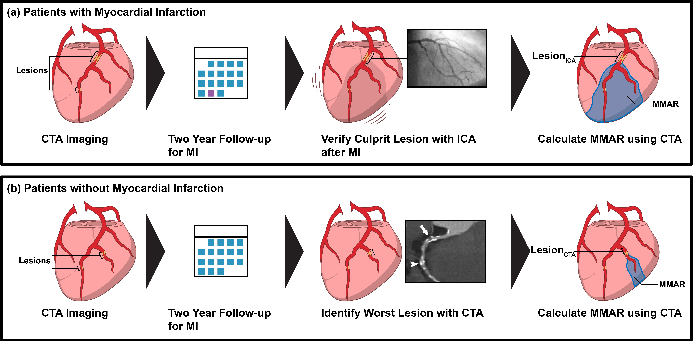
__Figure 1: Patient selection criteria for Aim 1.__  Aim 1 sought to compare myocardial mass at-risk (MMAR) distal to coronary artery disease (CAD) lesions in patients with and without a myocardial infarction (MI).  The minimum-cost path technique was used to determine MMAR for all lesions in each patient group.  Patients underwent cardiac CT angiography and were followed for two years for Major Adverse Cardiac Events.  (a) Patients with MI underwent invasive coronary angiography (ICA), during which a culprit lesion was verified (LesionICA).  LesionICA was then used to calculate MMAR for patients with MI.  (b) In patients without MI, the worst lesion was selected based on assessment using CTA (LesionCTA).  For the results in __Figure 2__, the lesion with the smallest __minimum lumen diameter__ was chosen as LesionCTA in patients without MI.

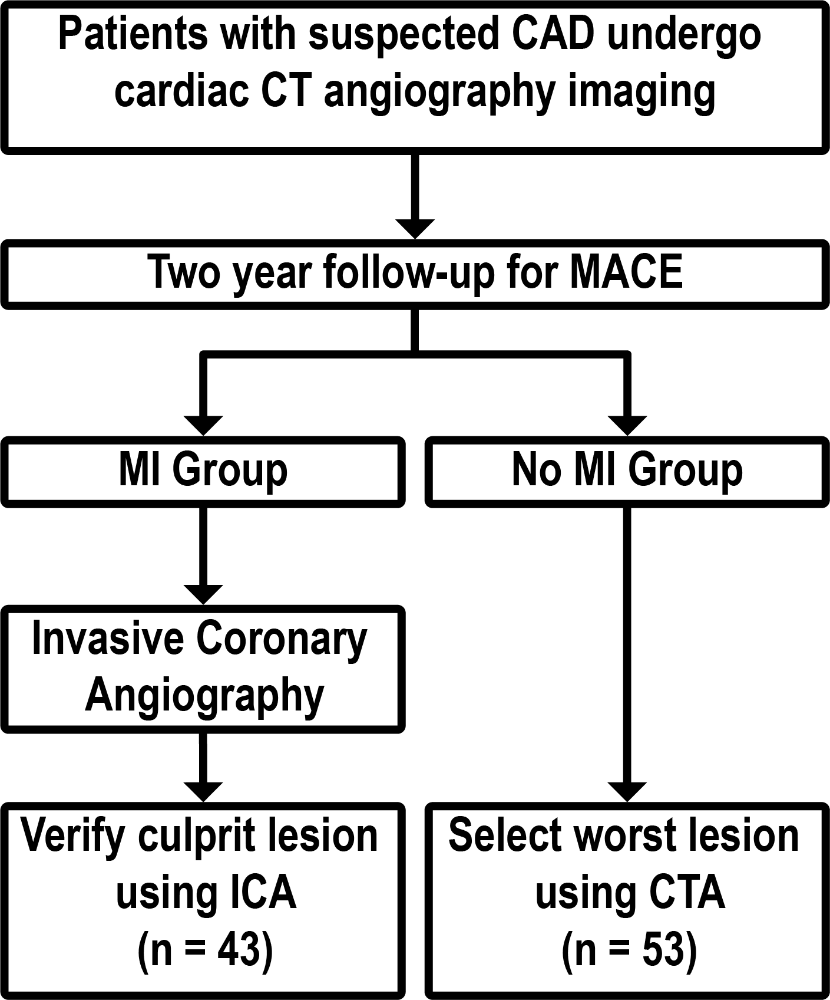
__Figure (flowchart) 1: Patient selection criteria for Aim 1.__  Aim 1 sought to compare myocardial mass at-risk (MMAR) distal to CAD lesions in patients with and without a myocardial infarction (MI).  The minimum-cost path technique was used to determine MMAR for all lesions in each patient group.  Patients underwent cardiac CT angiography and were followed for two years for Major Adverse Cardiac Events.  (a) Patients with MI underwent invasive coronary angiography (ICA), during which a culprit lesion was verified (LesionICA).  LesionICA was then used to calculate MMAR for patients with MI.  (b) In patients without MI, the worst lesion was selected based on assessment using CTA (LesionCTA).  For the results in __Figure 2__, the lesion with the smallest __minimum lumen diameter__ was chosen as LesionCTA in patients without MI.  For this study, a subset of 43 patients with MI and 53 patients without MI were selected for analysis.  Groups were matched using propensity scoring.  

_MMAR:_  Myocardial mass at-risk calculated by applying the minimum-cost path technique to cardiac CT angiography images

_ICA:_  Invasive coronary angiography

_MI:_  Myocardial infarction, defined as ST-elevation MI, non-ST-elevation MI, or unstable angina

_CTA:_  Cardiac CT angiography

#### Figure 2
##### Figure 2A:

__Figure 2A:  Box plot of absolute MMAR of MI and no MI groups.__
Patients from the CONFIRM study were split into two groups, patients with and without myocardial infarction (MI).  Absolute myocardial mass at-risk (absolute MMAR) was assessed in this figure.  For patients with MI (blue), the culprit lesion verified with invasive coronary angiography* was used to calculate MMAR from the cardaic CT angiography (CTA) acquired prior to MI event.  For patients without MI (red), the lesion with the smallest minimal lumen diameter was selected to calculate MMAR.

_*Invasive coronary angiography was performed at time of MI_

_Absolute MMAR:_  Absolute myocardial mass at-risk calculated by applying the minimum-cost path technique to cardiac CT angiography images

_ICA:_  Invasive coronary angiography

_MI:_  Myocardial infarction, defined as ST-elevation MI, non-ST-elevation MI, or unstable angina

_CTA:_  Cardiac CT angiography

[Figure 2A: Interactive link](results-09052020-figs/html/figure2a.html)

[See Table 2A for descriptive analysis](#table-2a)

##### Figure 2B:
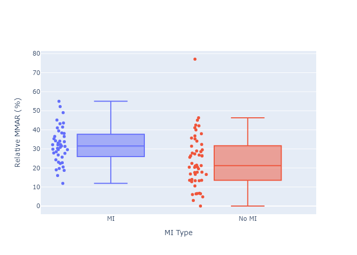

__Figure 2B:  Box plot of relative MMAR of MI and no MI groups.__
Patients from the CONFIRM study were split into two groups, patients with and without myocardial infarction (MI).  Relative myocardial mass at-risk (relative MMAR) was assessed in this figure, by normalizing absolute MMAR to respective patients' left ventricle mass.  For patients with MI (blue), the culprit lesion verified with invasive coronary angiography* was used to calculate MMAR from the cardaic CT angiography (CTA) acquired prior to MI event.  For patients without MI (red), the lesion with the smallest minimal lumen diameter was selected to calculate MMAR.  __Differences between relative MMAR between MI (blue) and no MI (red) groups was statistically significant (p-value <.05).__

_*Invasive coronary angiography was performed at time of MI_

_Relative MMAR:_  Relative myocardial mass at-risk calculated by applying the minimum-cost path technique to cardiac CT angiography images and normalizing to the respective patient's left ventricle myocardial mass

_ICA:_  Invasive coronary angiography

_MI:_  Myocardial infarction, defined as ST-elevation MI, non-ST-elevation MI, or unstable angina

_CTA:_  Cardiac CT angiography

[Figure 2B: Interactive link](results-09052020-figs/html/figure2b.html)
[See Table 2A for descriptive analysis](#table-2a)

##### Figure 2C:
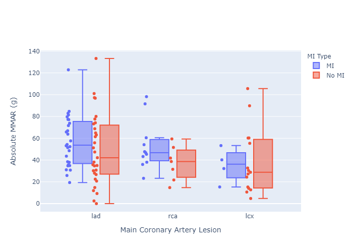

__Figure 2C:  Box plot of abosulte MMAR of MI and no MI groups, stratified by main coronary lesion location.__
Patients from the CONFIRM study were split into two groups, patients with and without myocardial infarction (MI).  MI and no MI groups were stratified based on location of selected coronary lesion in either the left anterior descending (LAD), left circumflex (LCx) or right coronary artery (RCA).  Absolute MMAR was assessed in this figure.  For patients with MI (blue), the culprit lesion verified with invasive coronary angiography* was used to calculate MMAR from the cardaic CT angiography (CTA) acquired prior to MI event.  For patients without MI (red), the lesion with the smallest minimal lumen diameter was selected to calculate MMAR.

_*Invasive coronary angiography was performed at time of MI_

_Absolute MMAR:_  Absolute myocardial mass at-risk calculated by applying the minimum-cost path technique to cardiac CT angiography images

_ICA:_  Invasive coronary angiography

_MI:_  Myocardial infarction, defined as ST-elevation MI, non-ST-elevation MI, or unstable angina

_CTA:_  Cardiac CT angiography

[Figure 2C: Interactive link](results-09052020-figs/html/figure2c.html)

[See Table 2B for descriptive analysis](#table-2b)

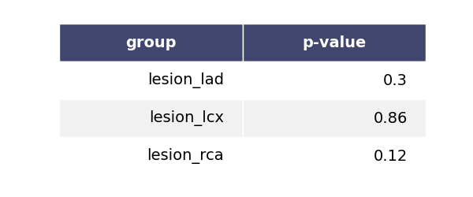

##### Figure 2D:
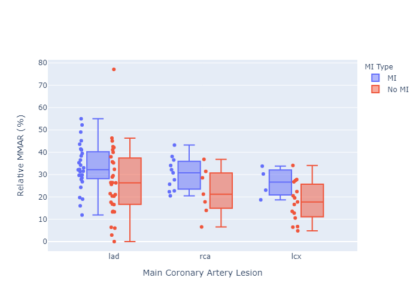

__Figure 2D:  Box plot of relative MMAR of MI and no MI groups, stratified by main coronary lesion location.__
Patients from the CONFIRM study were split into two groups, patients with and without myocardial infarction (MI).  MI and no MI groups were stratified based on location of selected coronary lesion in either the left anterior descending (LAD), left circumflex (LCx) or right coronary artery (RCA).  Relative MMAR was assessed in this figure.  For patients with MI (blue), the culprit lesion verified with invasive coronary angiography* was used to calculate MMAR from the cardaic CT angiography (CTA) acquired prior to MI event.  For patients without MI (red), the lesion with the smallest minimal lumen diameter was selected to calculate MMAR.

_*Invasive coronary angiography was performed at time of MI_

_Relative MMAR:_  Relative myocardial mass at-risk calculated by applying the minimum-cost path technique to cardiac CT angiography images and normalizing to the respective patient's left ventricle myocardial mass

_ICA:_  Invasive coronary angiography

_MI:_  Myocardial infarction, defined as ST-elevation MI, non-ST-elevation MI, or unstable angina

_CTA:_  Cardiac CT angiography

[Figure 2D: Interactive link](results-09052020-figs/html/figure2d.html)

[See Table 2B for descriptive analysis](#table-2b)

##### Figure 2E:
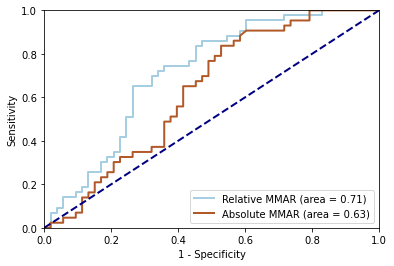

__Figure 2E:  Receiver operator characteristic (ROC) curves of prognostic value of MMAR in predicting MI.__   Analysis was performed using absolute MMAR (red) and relative MMAR, normalized to left ventricle myocardial mass (blue).  Occurrence of myocardial infarction (MI) was the outcome assessed.  Area under the curve analysis was 0.63 (p-value <.05) and 0.71 (p-value <.05) for absolute and relative MMAR, respectively.

_Absolute MMAR:_  Absolute myocardial mass at-risk calculated by applying the minimum-cost path technique to cardiac CT angiography images

_Relative MMAR:_  Relative myocardial mass at-risk calculated by applying the minimum-cost path technique to cardiac CT angiography images and normalizing to the respective patient's left ventricle myocardial mass

_MI:_  Myocardial infarction, defined as ST-elevation MI, non-ST-elevation MI, or unstable angina

[See Table 2A for descriptive analysis](#table-2a)

##### Figure 2F:
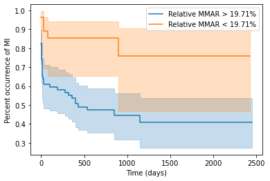

__Figure 2F:  Kaplan-Meier survival curve analysis of relative MMAR and occurrence of MI.__ Using receiver operator characteristic (ROC) curve analysis from __Figure 2E__, a cutoff of 19.71% relative MMAR was used for survival curve analysis.  Occurrence of myocardial infarction (MI) was the outcome assessed.  

_Relative MMAR:_  Relative myocardial mass at-risk calculated by applying the minimum-cost path technique to cardiac CT angiography images and normalizing to the respective patient's left ventricle myocardial mass

_MI:_  Myocardial infarction, defined as ST-elevation MI, non-ST-elevation MI, or unstable angina

[See Table 2A for descriptive analysis](#table-2a)

#### Table 2:
##### Table 2A:

##### Table 2B:

### Aim 2
Is extent of MMAR distal to a patient's __culprit lesion__ predictive of STEMI, NSTEMI, or unstable angina MI types?

#### Figure 3
##### Figure 3A:

__Figure 3A:  Box plot of absolute MMAR stratified by MI type.__
Patients from the CONFIRM study were split into two groups, patients with and without myocardial infarction (MI).  The MI group was further stratified into three groups, ST-segment elevation MI (STEMI; blue), non-ST-segment elevation MI (NSTEMI; red), and unstable angina (UA; green).  Patients without MI (purple) were also plotted.  Absolute myocardial mass at-risk (absolute MMAR) was assessed in this figure.  For patients with MI (STEMI, NSTEMI, and UA), the culprit lesion verified with invasive coronary angiography* was used to calculate MMAR from the cardaic CT angiography (CTA) acquired prior to MI event.  For patients without MI, the lesion with the smallest minimal lumen diameter was selected to calculate MMAR.

_*Invasive coronary angiography was performed at time of MI_

_Absolute MMAR:_  Absolute myocardial mass at-risk calculated by applying the minimum-cost path technique to cardiac CT angiography images

_ICA:_  Invasive coronary angiography

_MI:_  Myocardial infarction, defined as ST-elevation MI, non-ST-elevation MI, or unstable angina

_CTA:_  Cardiac CT angiography

_STEMI:_  ST-segment elevation MI

_NSTEMI:_ Non-ST-segment elevation MI

_UA:_  Unstable angina

[Figure 3A: Interactive link](results-09052020-figs/html/figure3a.html)

[See Table 3A for descriptive analysis](#table-3a)

##### Figure 3B:

__Figure 3B:  Box plot of relative MMAR stratified by MI type.__
Patients from the CONFIRM study were split into two groups, patients with and without myocardial infarction (MI).  The MI group was further stratified into three groups, ST-segment elevation MI (STEMI; blue), non-ST-segment elevation MI (NSTEMI; red), and unstable angina (UA; green).  Patients without MI (purple) were also plotted.  Relative myocardial mass at-risk (relative MMAR) was assessed in this figure, by normalizing absolute MMAR to respective patients' left ventricle mass.  For patients with MI (STEMI, NSTEMI, and UA), the culprit lesion verified with invasive coronary angiography* was used to calculate MMAR from the cardaic CT angiography (CTA) acquired prior to MI event.  For patients without MI, the lesion with the smallest minimal lumen diameter was selected to calculate MMAR.  __The differences between groups plotted were statistically significant (p-value <0.5 using ANOVA)__

_*Invasive coronary angiography was performed at time of MI_

_Relative MMAR:_  Relative myocardial mass at-risk calculated by applying the minimum-cost path technique to cardiac CT angiography images and normalizing to the respective patient's left ventricle myocardial mass

_ICA:_  Invasive coronary angiography

_MI:_  Myocardial infarction, defined as ST-elevation MI, non-ST-elevation MI, or unstable angina

_CTA:_  Cardiac CT angiography

_STEMI:_  ST-segment elevation MI

_NSTEMI:_ Non-ST-segment elevation MI

_UA:_  Unstable angina

[Figure 3B: Interactive link](results-09052020-figs/html/figure3b.html)

[See Table 3A for descriptive analysis](#table-3a)

##### Figure 3C:

__Figure 3C:  Box plot of abosulte MMAR stratified by MI type, grouped by main coronary lesion location.__
Patients from the CONFIRM study were split into two groups, patients with and without myocardial infarction (MI).  The MI group was further stratified into three groups, ST-segment elevation MI (STEMI; blue), non-ST-segment elevation MI (NSTEMI; red), and unstable angina (UA; green).  Patients without MI (purple) were also plotted.  MI type groups were stratified based on location of selected coronary lesion in either the left anterior descending (LAD), left circumflex (LCx) or right coronary artery (RCA).  Absolute MMAR was assessed in this figure.  For patients with MI (blue), the culprit lesion verified with invasive coronary angiography* was used to calculate MMAR from the cardaic CT angiography (CTA) acquired prior to MI event.  For patients without MI (red), the lesion with the smallest minimal lumen diameter was selected to calculate MMAR.

_*Invasive coronary angiography was performed at time of MI_

_Absolute MMAR:_  Absolute myocardial mass at-risk calculated by applying the minimum-cost path technique to cardiac CT angiography images

_ICA:_  Invasive coronary angiography

_MI:_  Myocardial infarction, defined as ST-elevation MI, non-ST-elevation MI, or unstable angina

_CTA:_  Cardiac CT angiography

_STEMI:_  ST-segment elevation MI

_NSTEMI:_ Non-ST-segment elevation MI

_UA:_  Unstable angina

[Figure 3C: Interactive link](results-09052020-figs/html/figure3c.html)

[See Table 3B for descriptive analysis](#table-3b)

##### Figure 3D:
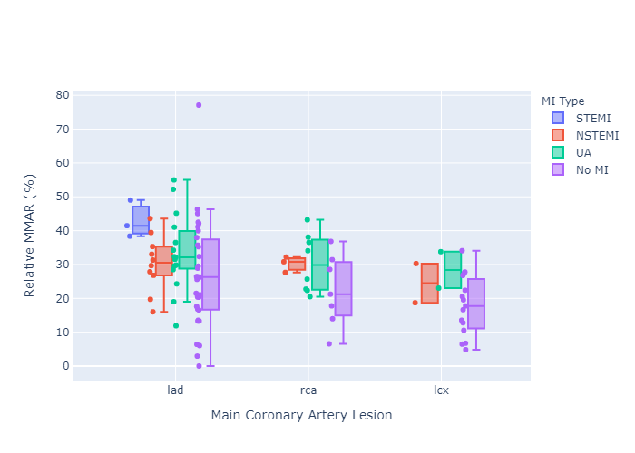

__Figure 3D:  Box plot of relative MMAR stratified by MI type, grouped by main coronary lesion location.__
Patients from the CONFIRM study were split into two groups, patients with and without myocardial infarction (MI).  The MI group was further stratified into three groups, ST-segment elevation MI (STEMI; blue), non-ST-segment elevation MI (NSTEMI; red), and unstable angina (UA; green).  Patients without MI (purple) were also plotted.  MI type groups were stratified based on location of selected coronary lesion in either the left anterior descending (LAD), left circumflex (LCx) or right coronary artery (RCA).  Relative MMAR was assessed in this figure.  For patients with MI (blue), the culprit lesion verified with invasive coronary angiography* was used to calculate MMAR from the cardaic CT angiography (CTA) acquired prior to MI event.  For patients without MI (red), the lesion with the smallest minimal lumen diameter was selected to calculate MMAR.

_*Invasive coronary angiography was performed at time of MI_

_Relative MMAR:_  Relative myocardial mass at-risk calculated by applying the minimum-cost path technique to cardiac CT angiography images and normalizing to the respective patient's left ventricle myocardial mass

_ICA:_  Invasive coronary angiography

_MI:_  Myocardial infarction, defined as ST-elevation MI, non-ST-elevation MI, or unstable angina

_CTA:_  Cardiac CT angiography

_STEMI:_  ST-segment elevation MI

_NSTEMI:_ Non-ST-segment elevation MI

_UA:_  Unstable angina

[Figure 3D: Interactive link](results-09052020-figs/html/figure3d.html)

[See Table 3B for descriptive analysis](#table-3b)

#### Table 3:
##### Table 3A:

##### Table 3B:

### Aim 3
Is there a significant difference in extent of MMAR distal to culprit versus non-culprit lesions in patients with MI?

#### Figure 4
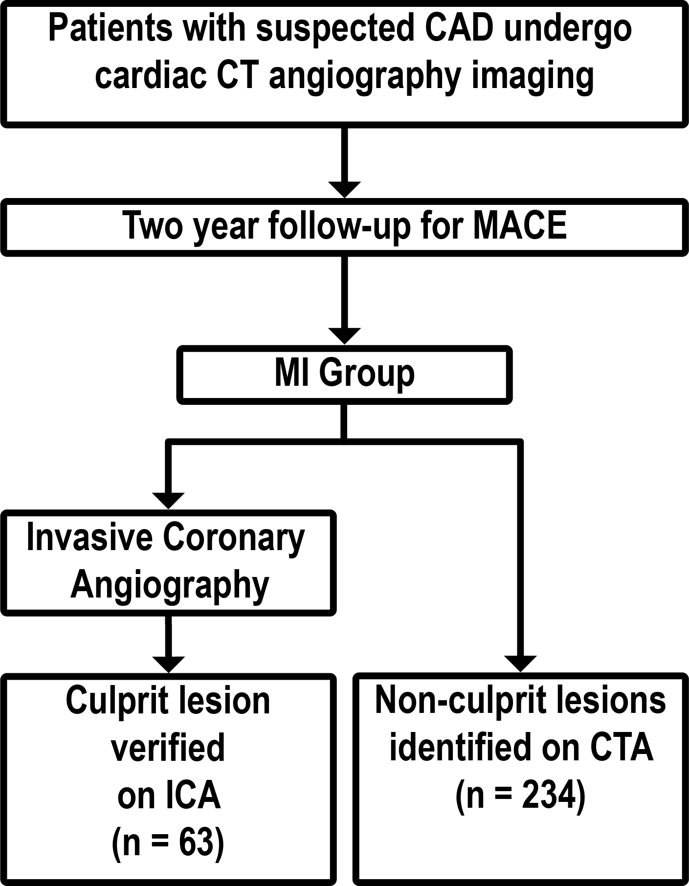
__Figure 4: Patient selection criteria for Aim 3.__  Aim 3 sought to compare myocardial mass at-risk (MMAR) distal to culprit and non-culprit CAD lesions in patients with myocardial infarction (MI).  The minimum-cost path tehcnique was used to determine MMAR for all lesions in patients with MI from the CONFIRM study.  Each patient underwent cardiac CT angiography and were followed for two years for Major Adverse Cardiac Events.  For analysis of Aim 3, only patients with MI were selected based on this two year follow-up.  The culprit lesion was defined as the lesion identified as causing MI, verified on invasive coronary angiography (ICA) and present on CTA.  All other coronary lesions identified on CTA that were not the verified culprit lesion, were categorized as non-culprit lesions.  For analysis in __Figure 5__, 63 patients were selected.  Each patient has 1 culprit lesion.  5 patients did not have additional non-culprit lesions, while the remaining 58 patients had 1 culprit lesion and at least 1 non-culprit lesion identified on CTA.

#### Figure 5

##### Figure 5A:

__Figure 5A:  Box plot of absolute MMAR of culprit and non-culprit lesions.__
Lesions from patients with myocardial infarction (MI) from the CONFIRM study were split into two groups, culprit and non-culprit lesions.  63 patients with MI were assessed.  There is one culprit lesion per patient assessed.  The culprit lesion was the lesion attributed to causing MI; confirmed using invasive coronary angiography (ICA)* present on cardiac CT angiography (CTA).  For each patient, multiple non-culprit lesions were present.  A non-culprit lesion was any coronary lesion present on CTA, other than the selected culprit lesion.  Absolute myocardial mass at-risk (MMAR) was calculated distal to each lesion present for 63 patients with MI.  Lesions were separated into culprit (blue) and non-culprit (red) lesions.  __The differences between MMAR distal to culprit versus non-culprit lesions was statistically significant (p-value <.05 using ANOVA).__

_*Invasive coronary angiography was performed at time of MI_

_Absolute MMAR:_  Absolute myocardial mass at-risk calculated by applying the minimum-cost path technique to cardiac CT angiography images

_ICA:_  Invasive coronary angiography

_MI:_  Myocardial infarction, defined as ST-elevation MI, non-ST-elevation MI, or unstable angina

_CTA:_  Cardiac CT angiography

[Figure 5A: Interactive link](results-09052020-figs/html/figure5a.html)

[See Table 5A for descriptive analysis](#table-5a)

##### Figure 5B:

__Figure 5B:  Box plot of relative MMAR of culprit and non-culprit lesions.__
Lesions from patients with myocardial infarction (MI) from the CONFIRM study were split into two groups, culprit and non-culprit lesions.  63 patients with MI were assessed.  There is one culprit lesion per patient assessed.  The culprit lesion was the lesion attributed to causing MI; confirmed using invasive coronary angiography (ICA)* present on cardiac CT angiography (CTA).  For each patient, multiple non-culprit lesions were present.  A non-culprit lesion was any coronary lesion present on CTA, other than the selected culprit lesion.  Relative myocardial mass at-risk (MMAR) was calculated distal to each lesion present for 63 patients with MI.  Relative MMAR was calculated by normalizing absolute MMAR to the respective patient's left ventricle myocardial mass (also determined using CTA).  Lesions were separated into culprit (blue) and non-culprit (red) lesions.  __The differences between MMAR distal to culprit versus non-culprit lesions was statistically significant (p-value <.05 using ANOVA).__

_*Invasive coronary angiography was performed at time of MI_

_Relative MMAR:_  Relative myocardial mass at-risk calculated by applying the minimum-cost path technique to cardiac CT angiography images and normalizing to the respective patient's left ventricle myocardial mass

_ICA:_  Invasive coronary angiography

_MI:_  Myocardial infarction, defined as ST-elevation MI, non-ST-elevation MI, or unstable angina

_CTA:_  Cardiac CT angiography

[Figure 5B: Interactive link](results-09052020-figs/html/figure5b.html)

[See Table 5A for descriptive analysis](#table-5a)

##### Figure 5C:
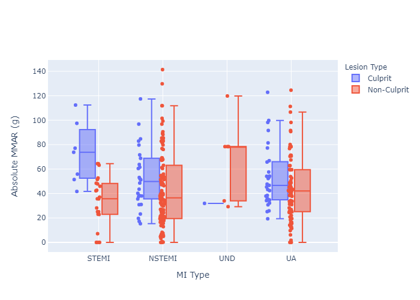

__Figure 5C:  Box plot of absolute MMAR of culprit and non-culprit lesions, stratified by MI type.__
Lesions from patients with myocardial infarction (MI) from the CONFIRM study were split into two groups, culprit and non-culprit lesions.  63 patients with MI were assessed.  There is one culprit lesion per patient assessed.  The culprit lesion was the lesion attributed to causing MI; confirmed using invasive coronary angiography (ICA)* present on cardiac CT angiography (CTA).  For each patient, multiple non-culprit lesions were present.  A non-culprit lesion was any coronary lesion present on CTA, other than the selected culprit lesion.  Absolute myocardial mass at-risk (MMAR) was calculated distal to each lesion present for 63 patients with MI.  Lesions were separated into culprit (blue) and non-culprit (red) lesions.  Lesions were further stratified into four groups, ST-segment elevation MI (STEMI), non-ST-segment elevation MI (NSTEMI), unstable angina (UA), and undetermined MI type (UND).  __The differences between MMAR distal to culprit versus non-culprit lesions for STEMI group was statistically significant (p-value <.05 using ANOVA).__

_*Invasive coronary angiography was performed at time of MI_

_Absolute MMAR:_  Absolute myocardial mass at-risk calculated by applying the minimum-cost path technique to cardiac CT angiography images

_ICA:_  Invasive coronary angiography

_MI:_  Myocardial infarction, defined as ST-elevation MI, non-ST-elevation MI, or unstable angina

_CTA:_  Cardiac CT angiography

_STEMI:_  ST-segment elevation MI

_NSTEMI:_ Non-ST-segment elevation MI

_UA:_  Unstable angina

_UND:_ Undetermined MI type

[Figure 5C: Interactive link](results-09052020-figs/html/figure5c.html)

[See Table 5B for descriptive analysis](#table-5b)

##### Figure 5D:

__Figure 5D:  Box plot of relative MMAR of culprit and non-culprit lesions, stratified by MI type.__
Lesions from patients with myocardial infarction (MI) from the CONFIRM study were split into two groups, culprit and non-culprit lesions.  63 patients with MI were assessed.  There is one culprit lesion per patient assessed.  The culprit lesion was the lesion attributed to causing MI; confirmed using invasive coronary angiography (ICA)* present on cardiac CT angiography (CTA).  For each patient, multiple non-culprit lesions were present.  A non-culprit lesion was any coronary lesion present on CTA, other than the selected culprit lesion.  Absolute myocardial mass at-risk (MMAR) was calculated distal to each lesion present for 63 patients with MI.  Lesions were separated into culprit (blue) and non-culprit (red) lesions.  Lesions were further stratified into four groups, ST-segment elevation MI (STEMI), non-ST-segment elevation MI (NSTEMI), unstable angina (UA), and undetermined MI type (UND).  __The differences between MMAR distal to culprit versus non-culprit lesions for STEMI, NSTEMI, and UA groups were statistically significant (p-value <.05 using ANOVA).__

_*Invasive coronary angiography was performed at time of MI_

_Relative MMAR:_  Relative myocardial mass at-risk calculated by applying the minimum-cost path technique to cardiac CT angiography images and normalizing to the respective patient's left ventricle myocardial mass

_ICA:_  Invasive coronary angiography

_MI:_  Myocardial infarction, defined as ST-elevation MI, non-ST-elevation MI, or unstable angina

_CTA:_  Cardiac CT angiography

_STEMI:_  ST-segment elevation MI

_NSTEMI:_ Non-ST-segment elevation MI

_UA:_  Unstable angina

_UND:_ Undetermined MI type

[Figure 5D: Interactive link](results-09052020-figs/html/figure5d.html)

[See Table 5B for descriptive analysis](#table-5b)

#### Table 5:
##### Table 5A:

##### Table 5B:

#### Figure 6
### Aim XX
#### Figure 7
#### Figure 8
#### Figure 9
### Aim XX
#### Figure 10
#### Figure 11
#### Figure 12

